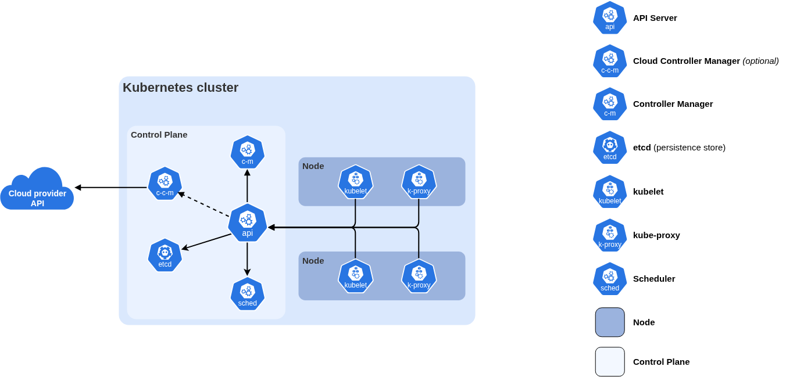

# How real production k8s cluster configured

- Managed Service (GKE, EKS) -> managed `CONTROL PLANE | MASTER NODE`

## Control Plane (Master Node)

- [https://kubernetes.io/docs/concepts/overview/components/](https://kubernetes.io/docs/concepts/overview/components/)
- API server 
  - The kube-apiserver is the central management hub of a Kubernetes cluster, exposing the Kubernetes API and acting as the frontend for the control plane
  - Below is an example of a production-ready kube-apiserver Static Pod manifest file, typically located at /etc/kubernetes/manifests/kube-apiserver.yaml on a control plane node.
  - When you execute a command like `kubectl apply -f deployment.yaml`, the request follows a specific sequence
  1. `Authentication`: kube-apiserver validates your client certificate or token.
  2. `Authorization`: RBAC rules determine if you have rights to create a Deploymen
  3. Persist data change to `etcd`
  4. Scheduled to the cluster (nodes) - scheduler 
- Cluster store `ETCD` 
  - the only statefull part in control plane store all configuration and state of cluster (for HA  use odd number of etcd, use RAFT consesus for consistency over HA with at least (n + 1) // 2 nodes avalialbe and leader election to accept write data) 
  - Ex ([https://technekey.com/check-whats-inside-the-etcd-database-in-kubernetes/](https://technekey.com/check-whats-inside-the-etcd-database-in-kubernetes/))
- Controller manager 
  - background controllers (seperate process) respond to event (pod failed, ensure observed states to desired state)
  - [https://kubernetes.io/docs/concepts/architecture/#kube-controller-manager](https://kubernetes.io/docs/concepts/architecture/#kube-controller-manager)
- Scheduler
  - assign pod to suitable node, behind the scence validate all worker node that capable of running pod on (node running, just shedule stuffs)
  - requirements, hardware/software/policy constraints, affinity and anti-affinity specifications, data locality, inter-workload interference, and deadlines
  - [https://kubernetes.io/docs/concepts/architecture/#kube-scheduler](https://kubernetes.io/docs/concepts/architecture/#kube-scheduler)
- Cloud controller manager 
  - Cloud like AWS, Azure, GCP, Digital Ocean,... 
  - If your application asks for an internet-facing loadbalancer, the cloud controller manager provisions a load-balancer from your cloud and connects it to your app

## Worker Node

- Kubelet: 
  - watch api server -> execute -> report back
- Container runtime: 
  - actual running a `POD` or container if you not familiar with pod :)))
- Kube-proxy: 
  - [https://kubernetes.io/docs/concepts/services-networking/dns-pod-service/](https://kubernetes.io/docs/concepts/services-networking/dns-pod-service/)
  - [https://devops.vn/posts/bai-17-quan-ly-dns-va-load-balancing-trong-kubernetes/](https://devops.vn/posts/bai-17-quan-ly-dns-va-load-balancing-trong-kubernetes/)
  - [https://viettelidc.com.vn/tin-tuc/dns-trong-kubernetes-la-gi-cach-hoat-dong-ra-sao-5436](https://viettelidc.com.vn/tin-tuc/dns-trong-kubernetes-la-gi-cach-hoat-dong-ra-sao-5436)
  - [https://spacelift.io/blog/kubernetes-dns-service](https://spacelift.io/blog/kubernetes-dns-service)
  - Manage local cluster networking, assign Ip address for node, iptables, IPVS rules, routing, load balance for `POD`

## Quick introduce Pod, Deployment

- Pod is wrapper of container, container running actual docker image (contains actual code, app, libs,...) 
- Pod is smallest unit in k8s world
- Pod is unit of scaling (add more pod, not add more container :))) )
- Pod is immutability: when running no edit, create the new one with new configuration 
- Pod lifecycle: when pod die, do it restart ? no it created a new one -> new IP address assign -> so we dont expect stable ip address on `POD` level -> Service came to solve that provide reliable networking ( stable IP addresses and DNS name ) for `POD`at TCP | UDP routing, load balancing, so that not supporing applicatin path routing, using `Ingess` to support this at Http layer 
- Deploment wrapper of Pod like Deployments, DaemonSets, and StatefulSets, support cloud-native feature self-healing, scaling, zero-downtime rollouts, and versioned rollbacks. Behind the scence is watch loop to manage states 

