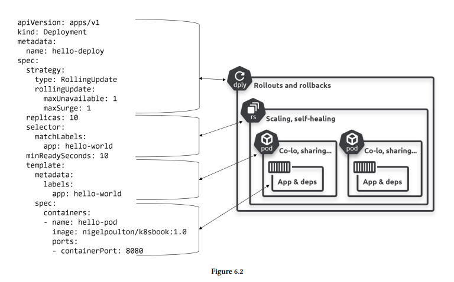
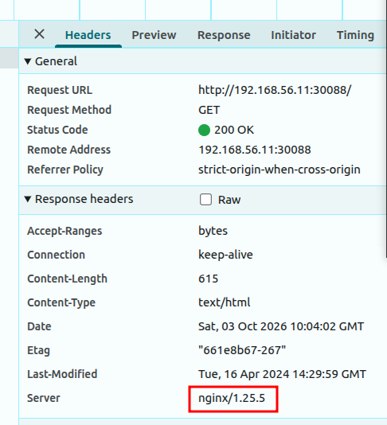

- Deployments to bring cloud-native features such as self-healing, scaling,
rolling updates, and versioned rollbacks to stateless apps on Kubernetes.

# ReplicaSet



- Think of Deployments as managing ReplicaSets, and ReplicaSets as managing Pods.
- pod failed -> will be replaced -> self-healing
- pod increased and decreased based on load -> scaled 

# Rolling update with Deployments

- Zero-downtime, 
  1. Loose coupling via APIs
  2. Backwards and forwards compatibility

# Handson

### 1. Create a Deployment
```bash
kubectl apply -f "/home/ducanh/Downloads/k8s_h/4.Deployments/simple-deployment.yaml"
```

### 2. Inspect Deployment, ReplicaSet, and Pods
```bash
# Check deployment status
kubectl get deployments -o wide

# Check ReplicaSet created by deployment
kubectl get rs

# Check pods managed by the deployment
kubectl get pods -l app=nginx -o wide
```

### 3. Expose Deployment to Outside Cluster (NodePort Service)
```bash
# Apply Service
kubectl apply -f "/home/ducanh/Downloads/k8s_h/4.Deployments/simple-service.yaml"

# Inspect Service
kubectl get svc nginx-service -o wide

# Access from outside cluster (Host Machine) via ANYYYYY Master/Worker IP:
curl http://192.168.56.11:30088
```
### 2 Perform scaling operations

- View number of replica 
  - kubectl get deploy nginx-deployment 
- Scale up
  - kubectl scale deploy nginx-deployment --replicas 5
- or manually edit for matching manifest 
- 
### 3 Perform a rolling update

- **Cách 1: Dùng lệnh trực tiếp (Imperative):**
  ```bash
  kubectl set image deployment/nginx-deployment nginx=nginx:1.25
  ```
- **Cách 2: Áp dụng file manifest V2 (Declarative - Chuẩn GitOps):**
  ```bash
  kubectl apply -f "/home/ducanh/Downloads/k8s_h/4.Deployments/simple-deployment-v2.yaml"
  # Hoặc chạy script tự động:
  /home/ducanh/Downloads/k8s_h/4.Deployments/trigger-rolling-update.sh
  ```
- Track rollout progress in real-time:
  ```bash
  kubectl rollout status deployment/nginx-deployment
  ```
   or watch real time pod
   `kubectl get pods -l app=nginx -o wide -w`
- Observe how Kubernetes creates a **NEW ReplicaSet** and gradually drains the **OLD ReplicaSet**:
  ```bash
  kubectl get rs -l app=nginx
  ```
  *(Old RS scales down to 0, New RS scales up to desired replicas without downtime)*.

- Check rollout history / revisions:
  ```bash
  kubectl rollout history deployment/nginx-deployment
  ```

### 4 Rollback to previous version (Undo)

- Rollback to immediately preceding revision:
  ```bash
  kubectl rollout undo deployment/nginx-deployment
  ```
- Or rollback to a specific revision:
  ```bash
  kubectl rollout undo deployment/nginx-deployment --to-revision=1
  ```
- Verify rollback status:
  ```bash
  kubectl rollout status deployment/nginx-deployment
  kubectl get pods -l app=nginx -o jsonpath="{.items[*].spec.containers[*].image}"
  ```



## Rollouts and labels

 - Deployments and ReplicaSets use `labels and selectors` to find Pods they own.
 - Later service use label and selector to scheduling and traffic load balance also 


## Handson ZeroDowntime